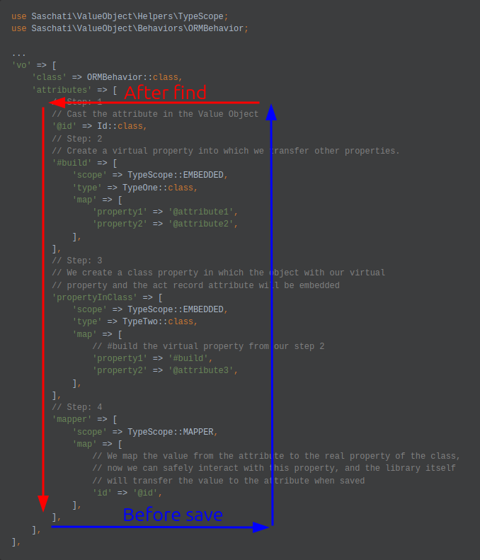

Yii2 Value Object
=================
 This extension will help you work with your fields in the database as objects, selecting them from scalar values 
 in objects and vice versa. Also you will be able to make flat types for on type
 json and in an array and to convert such scalar data as tinyint in bool.

Installation
------------

The preferred way to install this extension is through [composer](http://getcomposer.org/download/).

Either run

```bash
composer require saschati/yii2-value-object "*"
```

or add

```json
"saschati/yii2-value-object": "*"
```

to the require section of your `composer.json` file.


Usage
-----
You just need to connect one of the behavior variations to your ActiveRecord model
```php
use Saschati\ValueObject\Behaviors\ORMBehavior;
use Saschati\ValueObject\Types\ValueObjects\EmailType;
use Saschati\ValueObject\Types\ValueObjects\UuidType;
use Saschati\ValueObject\Types\Flats\BooleanType;
use Saschati\ValueObject\Types\Flats\TimestampType;
use Saschati\ValueObject\Helpers\TypeScope;
...

class User extends ActiveRecord
{
    private Name $name;

    ...
    public function behaviors(): array
    {
        return [
            'vo' => [
                'class' => ORMBehavior::class,
                'attributes' => [
                    'id' => UuidType::class,
                    'email' => EmailType::class,
                    'active' => 'boolean', // BooleanType::class
                    'created_at' => 'timestamp', // TimestampType::class,
                    'name' => [
                        'scope' => TypeScope::EMBEDDED,
                        'type' => Name::class,
                        'map' => [
                            'firstname' => 'firstname',
                            'lastname' => 'lastname',
                            'middlename' => 'middlename',
                        ],
                    ],
                ],
            ],
        ];
    }
    ...
}
```
Mapping of properties takes place with the help of handlers that process them,
documentation about available handlers is how to create a custom:
- [Value Object data types, using ValueObjectHandler](docs/vo.md)
- [Flat data types, using FlatTypeHandler](docs/flat.md)
- [Embedded data types, using EmbeddedHandler](docs/embedded.md)
- [Mapped attribute, using MapperHandler](docs/mapper.md)
- [Create instance via constructor, using ConstructorHandler](docs/constructor.md)
- [Create instance via Yii::create, using YiiCreateHandler](docs/yii.md)
- [Each item, using EachHandler](docs/each.md)
- [Custom handler, using AbstractHandler or HandlerInterface](docs/custom.md)
---

<a name="main-property"></a>Property/Virtual Attribute/DB Attribute
-----
Also, mapping has several features for defining properties, such as:
- `@property` - "@"
  always indicates that the property with which we interact must be an attribute,
  that is, we map to the attribute and map from the attribute.
- `#buildOrVirtualProperty` - "#" this prefix points to a non-existent property in the object, which is a simple
  intermediate build and will simply be stored in a separate location.
- `property` - This indicates that the property is available in the entity class, that is, if you declare such
  a property directly in the class, the library will interact with it.

Example:
```php
use Saschati\ValueObject\Helpers\TypeScope;
use Saschati\ValueObject\Behaviors\ORMBehavior;

...
'vo' => [
    'class' => ORMBehavior::class,
    'attributes' => [
        // Step: 1
        // Cast the attribute in the Value Object
        '@id' => Id::class,
        // Step: 2
        // Create a virtual property into which we transfer other properties.
        '#build' => [
            'scope' => TypeScope::EMBEDDED,
            'type' => TypeOne::class,
            'map' => [
                'property1' => '@attribute1',
                'property2' => '@attribute2',
            ],
        ],
        // Step: 3
        // We create a class property in which the object with our virtual
        // property and the act record attribute will be embedded
        'propertyInClass' => [
            'scope' => TypeScope::EMBEDDED,
            'type' => TypeTwo::class,
            'map' => [
                // #build the virtual property from our step 2
                'property1' => '#build',
                'property2' => '@attribute3',
            ],
        ],
        // Step: 4
        'mapper' => [
            'scope' => TypeScope::MAPPER,
            'map' => [
                // We map the value from the attribute to the real property of the class,
                // now we can safely interact with this property, and the library itself
                // will transfer the value to the attribute when saved
                'id' => '@id',
            ],
        ],
    ],
],
```
This mapping works according to the principle:
 - **After Find** - from right to left, top to bottom.
 - **Before Save** - from left to right, bottom to top.

---

Nested properties
---
One of the features of the library is that it can work with nested properties,
arrays of objects and arrays of objects.

Example:

`contact` column in DB
```json
{
    "phone": "0987654321",
    "email": "user@user.user",
    "address": {
      "country": "Ukraine",
      "region": "Khmelnytskyi",
      "city": "Khmelnytskyi",
      "street": "Institute",
      "house": "11/3"
    }
}
```
mapping
```php
use Saschati\ValueObject\Behaviors\ORMBehavior;
use Saschati\ValueObject\Types\Flats\JsonType;
use Saschati\ValueObject\Helpers\TypeScope;

class User extends ActiveRecord
{
    /**
     * @var Contact 
     */
    private Contact $contact;
    
    /**
     * @var string 
     */
    private string $region;

    ...
    public function behaviors(): array
    {
        return [
            'vo' => [
                'class' => ORMBehavior::class,
                'attributes' => [
                    // STEP: 1
                    // We convert the contact attribute into an array
                    '@contact' => JsonType::class,
                    '#address' => [
                        'scope' => TypeScope::EMBEDDED,
                        'type' => Address::class,
                        'map' => [
                            // STEP: 2
                            // Assign the nested address from the contact attribute
                            // to the properties of the Address class
                            'country' => '@contact.address.country',
                            'region' => '@contact.address.region',
                            'city' => '@contact.address.city',
                            'street' => '@contact.address.street',
                            'house' => '@contact.address.house',
                        ]
                    ],
                    'contact' => [
                        'scope' => TypeScope::EMBEDDED,
                        'type' => Contact::class,
                        'map' => [
                            // STEP: 3
                            // We put other keys in properties of the Contact class
                            'phone' => '@contact.phone',
                            'email' => '@contact.email',
                            'address' => '#address',
                        ]
                    ]
                    'mapper' => [
                        'scope' => TypeScope::MAPPER,
                        'map' => [
                            // STEP: 4
                            // We take the property from the build and assign it to the class property.
                            // ===================
                            // It is better not to do this:)
                            // Try to change the properties through one VO, and not spread it throughout the model
                            'region' => '#address.region',
                        ],
                    ],
                ],
            ],
        ];
    }
    ...
}

class Address
{    
    /**
     * @var string 
     */
    private string $country;
    
    /**
     * @var string 
     */
    private string $region;
    
    /**
     * @var string 
     */
    private string $city;
    
    /**
     * @var string 
     */
    private string $street;
    
    /**
     * @var string 
     */
    private string $house;
    
    ...
}

class Contact
{
    /**
     * @var string 
     */
    private string $phone;
    
    /**
     * @var string 
     */
    private string $email;
    
    /**
     * @var Address 
     */
    private Address $address;
    
    ...
}
```
If you define these properties for handlers that can process them independently,
then the library itself will store the data in the place from where it received it during extraction.
But at the moment there is a list of handlers that do not support the reverse property mapper, this:
- [ConstructorHandler](docs/constructor.md)
- [YiiCreateHandler](docs/yii.md)

For these handlers, you need to define a resolver that accepts a handler with extensions
of an [AbstractHandler](docs/custom.md) that, in turn, can work with these attributes.

Example with implementation above:
```php
use Saschati\ValueObject\Types\Flats\JsonType;
use Saschati\ValueObject\Helpers\TypeScope;
use Saschati\ValueObject\Scope\Handlers\ConstructorHandler;
use Saschati\ValueObject\Scope\Handlers\YiiCreateHandler;

'vo' => [
    'class' => ORMBehavior::class,
    'attributes' => [
        ...
        '#address' => [
            'scope' => TypeScope::CONSTRUCTOR,
            'type' => Address::class,
            'params' => [
                '@contact.address.country',
                '@contact.address.region',
                '@contact.address.city',
                '@contact.address.street',
                '@contact.address.house',
            ],
            'resolver' => static function (Address $address, User $user, ConstructorHandler $handler): void {
                $handler->setAttribute($user, '@contact.address.country', $address->getCountry());
                $handler->setAttribute($user, '@contact.address.region', $address->getRegion());
                $handler->setAttribute($user, '@contact.address.city', $address->getCity());
                $handler->setAttribute($user, '@contact.address.street', $address->getStreet());
                $handler->setAttribute($user, '@contact.address.house', $address->getHouse());
            }
        ],
        ...
        'contact' => [
            'scope' => TypeScope::YII_CREATE,
            'type' => Contact::class,
            'params' => [
                'phone' => '@contact.phone',
                'email' => '@contact.email',
                'address' => '#address',
            ],
            'resolver' => static function (Contact $contact, User $user, YiiCreateHandler $handler): void {
                $handler->setAttribute($user, '@contact.phone', $contact->getPhone());
                $handler->setAttribute($user, '@contact.email', $contact->getEmail());
                $handler->setAttribute($user, '#address', $contact->getAddress());
            }
        ]
        ...
    ],
],
```
And then the library itself will break it down into keys or properties and find the
necessary nested property that needs to be changed.